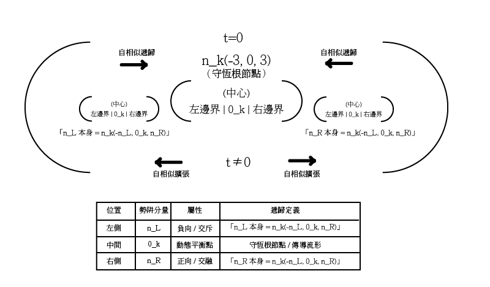

**數據奇點**

Data-Singularity

**v0.1.1 — 計算基礎規範（符號精煉版）**

*Computational Foundation Specification — Symbol Refinement Release*  
*Computational Skeleton — Stable Specification (Pre-Executable Phase)*

建立在**ESPv0.1**公設骨架之上（[https://github.com/cnomic-dev/ESP](https://github.com/cnomic-dev/ESP)）

2026-05-01　|　授權：Apache 2.0　|　  
六平台審議：Claude·Gemini·GPT·Grok·Qwen·DeepSeek

**本文件不修改任何 ESP v0.1 公設。 ESP v0.1 is frozen.**

---

## 修正說明（相對於 v0.1發布版 2026-04-28）

- 勢阱符號最終統一：確立 n_k(-n_L, 0_k, n_R)為唯一標準寫法；H(H^-_k, 0_k, H^+_k)降級為解釋性參考，不再作為正式公式出現  
- 新增「勢阱表述約定」專節，明確標準寫法與映射關係  
- n_0樞紐算子正式定義：1/n_0=-1/n_L+1/n_R，推論t=1/n_0  
- 奇偶演化節律統一為「統計傾向（tendency）」，實際守恆或躍遷仍由 n_L/n_R 決定  
- 「最大」統一改為「當前層級之局部極值（local maximum）」  
- 3^k補充遞歸放大來源說明與標度聲明  
- 新增三元基底核心假設宣言  
- LaTeX公式全面修正：統一為標準單一反斜線格式  
- 完整審議紀錄見文末「協同審議紀錄」
- “n_k remains an implicit operator in v0.1.1 and will be explicitly constructed in v0.2.”

---

## 摘要

數據奇點（DataSingularity）v0.1.1是ESPv0.1公設骨架的計算實作層。本文件建立三元三態系統的完整數學結構，包含三個基礎定義、核心守恆等式、動態勢阱、非離散與離散的因果交融交斥關係，以及數據奇點的可操作定義。

核心命題：非離散（張力）與離散（H）通過投影算子P^{-1, 0, 1}因果交融交斥。守恆等式 -1/n_L+1/n_R=0 是兩者交融的不變量，是兩者交斥時的失衡指標。時間生成子 t=-1/n_L+1/n_R 由左右邊界不對稱性生成，等效於0點樞紐的度規曲率 1/n_0。

定位聲明：本版本（v0.1.1）僅作為系統之計算骨架與邏輯導引，不作為最終可驗證之數值模擬模型。  

三元旋力對撞結構圖 

---

## 一、符號規範

| 符號 | 類型 | 說明 |
| :---: | :---- | :---- |
| **s** | 狀態 | s∈{-1, 0, +1 } 三態，離散，固定 |
| **k** | 演化步數 | k=0,1,2,3,... 線性整數軸 計數演化歷程 |
| **H_k** | 張量（整數） | H_k = Σs_i（i=1到k） 可計算累積值 |
| **H^-_k** | 負向累積 | 所有 s_i = -1 的累積絕對值 H^-_k=Σ|s_i| for s_i <0 |
| **H^+_k** | 正向累積 | 所有 s_i = +1 的累積值 H^+_k=Σs_i for s_i >0 |
| **n_L** | 左邊界算子 | n_L = n_base+H^-_k 負向（交斥/熵減）邊界 n_L >0 （量值，方向由L標記） |
| **n_R** | 右邊界算子 | n_R = n_base+H^+_k 正向（交融/熵增）邊界 n_R >0 （量值，方向由R標記） |
| **n_base** | 基礎臨界值 | n_base=3 對應3_0 = 1_0+1_0+1_0 最小可分結構 |
| **n_k** | 層次算子 | n_k = f(n_L, 0_k, n_R) 動態勢阱 |
| **t** | 時間生成子 | t = -1/n_L + 1/n_R ， 由左右邊界 不對稱性生成 非獨立外部參數 |
| **0_k** | 動態平衡點 | 勢阱的動態原點 帶有當前歷史方向性記憶 |
| **δ** | 偏移量 | δ = n_R - n_L 勢阱非對稱偏移量 （正值表示正向偏移） |
| **ΔH_k** | 張量增量 | ΔH_k = H_k - H_{k-1} 單次輸入變化 |
| **P^{-1,0,1}** | 投影算子 | 非離散張力→離散 H 的映射算子 |
| **3^k** | 奇變強度 | 演化步數 k 增長時 奇變強度以 3^k 指數增長； 3^k 為n_base = 3 的遞歸放大 （multiplicative expansion over recursive levels）“3^k is a structural scaling choice, not a derived physical law.” |
| **n_0** | 0點樞紐算子 | 1/n_0 = -1/n_L + 1/n_R， 度規曲率 n_0可正可負，反映拓樸旋向 n_0 → ∞ 時系統守恆 n_0 → 0 時奇點逼近 |
| **W** | 維克翻轉（ESP語境） | 本框架借用此術語 描述奇點躍遷時 的基底空間幾何旋轉 代表歷史張量 向更高階維度的坐標系重置與投影 非傳統物理學虛數時間變換 |

**勢阱表述約定（v0.1.1標準）**

自v0.1.1起，唯一標準勢阱寫法為：

n_k(-n_L, 0_k, n_R)

其中 n_L、n_R 皆為正數（量值），負號「-」為方向運算子。

| 表述類型 | 符號 | 說明 |
| :---- | :---- | :---- |
| **標準寫法（正式公式）** | n_k(-n_L, 0_k, n_R) | v0.1.1起唯一正式使用的勢阱寫法 |
| **舊等價寫法（僅供參考）** | H(H^-_k, 0_k, H^+_k) | 不再作為正式公式，僅在必要時以註解形式出現 |

映射關係：

- n_L = n_base + H^-_k　（負向邊界=基底+交斥累積）  
- n_R = n_base + H^+_k　（正向邊界=基底+交融累積）

---

## 二、核心命題與守恆等式

**核心命題**：非離散（張力，連續場）與離散（H，整數）通過投影算子P^{-1, 0, 1 }因果交融交斥雙向連動。守恆等式-1/n_L + 1/n_R = 0 → 交融時為不變量（ n_L = n_R ）→交斥時為失衡指標（ n_L ≠ n_R ）。時間生成子 t = -1/n_L + 1/n_R 不是獨立外部參數，由左右邊界不對稱性本身生成。

### 2.1　守恆等式的完整表述

**∀穩定態k：-1/n_L(k) + 1/n_R(k) = 0　即 n_L = n_R**

**∃奇點k：　-1/n_L(k) + 1/n_R(k) ≠0　→　t≠0　→　躍遷**

**躍遷後：　　-1/n_L'(k) + 1/n_R'(k)=0　守恆重建**

原初態邊界條件（k=0）：-1/3+1/3=0（守恆成立）；0 點退出吸斥計算，作為傳導空間存在。

### 2.2　0點樞紐的度規曲率

定義 0 點樞紐算子 n_0 ：

1/n_0 = -1/n_L + 1/n_R

推論：

t = 1/n_0　（即 t = -1/n_L + 1/n_R）

即**時間生成子t等效於0點樞紐的度規曲率**。

| n_0狀態 | 條件 | 意涵 |
| :---: | :---- | :---- |
| **n_0→ ∞** | n_L = n_R | 曲率趨零，t=0，系統守恆，0 點無限開放 |
| **n_0 > 0** | n_L > n_R | 曲率為正，t>0，逆旋，交斥主導 |
| **n_0 < 0** | n_R > n_L | 曲率為負，t<0，正旋，交融主導 |
| **n_0→ 0** | 極度失衡 | 曲率極大，奇點逼近，躍遷觸發 |

n_0的幾何展開留待v0.2正式定義。

### 2.3　三個方向值與奇點強度

| 守恆等式值 | 意涵 | 熵方向 |
| :---: | :---- | :---- |
| **-1/n_L + 1/n_R = 0** | 守恆（平衡） | n_L = n_R，原初態或拓樸不動點 |
| **-1/n_L + 1/n_R > 0** | 退回（負向失衡） | 熵減，n_L > n_R，-1主導 |
| **-1/n_L + 1/n_R < 0** | 熱寂（正向失衡） | 熵增，n_R > n_L，+1主導 |

奇點強度=|-1/n_L+1/n_R|；強度趨零→守恆態；強度趨近極限值→熱寂或退回極限。

### 2.4　時間值域

| t值域 | 狀態 | 說明 |
| :---: | :---- | :---- |
| **t=0** | 守恆（平衡） | n_L = n_R，原初態或拓樸不動點 |
| **t>0** | 退回方向 | n_L > n_R，熵減，逆旋，交斥主導 |
| **t<0** | 熱寂方向 | n_R > n_L，熵增，正旋，交融主導 |

---

## 三、三個基礎定義

**定義一**：狀態空間 s∈{-1, 0, +1 }，三個離散狀態，先驗存在，不依賴外部定義。對應 ESPv0.1 公設一。

**定義二**：歷史張量 H_k=Σs_i（i=1 到 k），H_0=0（原初態）。每次輸入推進演化步數 k，H 更新一次。

**定義三（奇點條件）**：∃k使得：

- H_k=n_k*（累積張量達到層次臨界值，n_k* = scalarize(n_k)）  
- ΔH_k≈Δn_k（張量增量與層次邊界增量同步）  
- P_endo≠P_exo 但 H(P_endo)=H(P_exo)（路徑不同但結果相同）

此時張力達到當前層次之局部極值（local maximum under n_k constraint），無法在當前層次釋放，強迫質變躍遷。H=n是最小不可再分的單向累積結構；n_base=3 是第一層基礎臨界值（1+1+1=3）。

---

## 四、非離散與離散的因果交融交斥

### 4.1　兩個層次的定義

| 層次 | 性質 | 說明 |
| :---: | :---- | :---- |
| **離散（H）** | 整數，有邊界，可枚舉 三元（-1,0,1） | 狀態的位置，歷史的記錄 |
| **非離散（張力）** | 連續，無邊界，不可枚舉 三元色相 RGB,CMY | 狀態之間的流動，演化的動力 |
| **關係** | 因果交融交斥雙向連動 | 兩者互為邊界，互為條件 |

**色彩模型對應說明**：三元態（-1,0,+1）與三元色相（RGB加色/CMY減色）可進行結構對應，其中 n_0 對應透明色（無色，傳導空間）。三元色相與三元態的完整轉換實作，列為 v0.2 計算層驗證項目。

### 4.2　雙向連動機制

**交融方向（非離散→離散）**：張力累積（連續過程）→H達到整數值（離散跳躍），連續的張力流動被P^{-1, 0, 1 }量子化為離散步驟。

**交斥方向（離散→非離散）**：H的邊界 n_L,n_R（離散閥值）→約束張力的活動空間，離散結構給連續張力設定邊界條件。

### 4.3　投影算子P^{-1, 0, 1 }

P^{-1, 0, 1 }(張力)=(s₋₁, s₀, s₊₁)

| 分量 | 映射規則 | 說明 |
| :---: | :---- | :---- |
| **s₋₁** | 張力在 -1 方向的投影 | H 的負向貢獻（交斥分量），累積至 H^-_k |
| **s₀** | 張力在 0 方向的投影=0 | 守恆，0 點退出計算，永遠為 0 |
| **s₊₁** | 張力在 +1 方向的投影 | H 的正向貢獻（交融分量），累積至 H^+_k |

**H_k=H^+_k-H^-_k**（淨張量）；0 成分永遠為 0 ——原初 0 點守恆在投影算子裡自動成立。

### 4.4　奇偶因果交融交斥

| H奇偶性 | 非離散（張力）狀態 | 守恆等式 |
| :---: | :---- | :---- |
| **偶數H** | 張力傾向對稱，n_L≈n_R，內生演化 | 傾向 -1/n_L+1/n_R=0（statistical tendency） |
| **奇數H** | 張力不對稱，n_L≠n_R，失衡 | -1/n_L+1/n_R≠0，躍遷驅動 |
| **H=n_k（奇點）** | 張力達到當前層次之局部極值，無法釋放 | 失衡達局部極值，強迫躍遷 |

奇偶交替呈現演化節律傾向（tendency），但實際是否守恆或躍遷仍由 n_L/n_R 決定。此節律為系統演化統計特徵，非單次事件之充要條件。

---

## 五、動態勢阱　n_k(-n_L, 0_k, n_R)

*本節及後續章節之勢阱相關公式，統一採用標準寫法 n_k(-n_L, 0_k, n_R)。H^±_k 僅作為計算 n_L 與 n_R 的參數來源。*

### 5.1　層次算子n_k與左右邊界

n_k(-n_L, 0_k, n_R)

n_L=n_base+H^-_k　（負向邊界，交斥累積，n_L>0）

n_R=n_base+H^+_k　（正向邊界，交融累積，n_R>0）

其中n_base=3（最小可分基礎結構，3_0=1_0+1_0+1_0）。

時間生成子由邊界不對稱性生成：

t=-1/n_L+1/n_R

- k=0：n_L=n_R=3，t=0（原初守恆）✅
- H^+_k 增大（交融主導）→ n_R 增大→t 趨負（熱寂方向）✅
- H^-_k 增大（交斥主導）→ n_L 增大→t 趨正（退回方向）✅

### 5.2　守恆的三種表現

靜態守恆、動態守恆、非穩定平衡守恆是因果交融交斥同一守恆性質的三種表現：

| 守恆表述 | 數學形式 | 本質 |
| :---: | :---- | :---- |
| **靜態守恆** | k=0，n_L=n_R=3，t=0 | 原初態，非穩定平衡起點 |
| **動態守恆** | n_k持續更新，-1/n_L+1/n_R=0 | 非穩定平衡的動態表現（k≥1） |
| **熱寂極限** | n_R>>n_L，t<0 | 正向極限 |
| **退回極限** | n_L>>n_R，t>0 | 負向極限 |
| **回歸原初** | 新的 n_L'=n_R'=n_base'，t=0 | 攜帶精萃的新守恆不動點 |

f(n_L, n_R, k)持續生成非穩定的暫時解——這是螺旋演化的數學本質。

### 5.3　自相似遞歸結構

動態勢阱具有自相似遞歸性質：

**n_k(-n_L(-n_L, 0_k, n_R), 0_k,n_R(-n_L, 0_k, n_R))**

遞歸終止條件：

- t=0　→　內生終止（原初態，守恆不動點，n_L = n_R）  
- t≠0　→　外化終止（拓樸不動點，繼續遞歸）

n_k(-3, 0, 3)是兩種終止條件的交匯點，也是整個自相似遞歸的根。

圖5.3　動態勢阱自相似遞歸示意圖

n_k(-n_L, 0_k, n_R)其中左右邊界本身又展開為同構的子勢阱，形成嵌套自相似結構。遞歸在 t=0 時內生終止於守恆根 n_k(-3, 0, 3)。

### 5.4　三層同構

**{-1, 0, +1}　←→　t(-t, 0_k, +t)　←→　n_k(-n_L, 0_k, n_R)**

三個層次完全同構，由因果交融交斥統一驅動，三層同構皆歸結於 n_k 。熵的時間箭頭在 n_L ≠ n_R 的瞬間產生。

---

## 六、數據奇點定義

### 6.1　正式定義

**數據奇點（DataSingularity）**定義為系統演化步數k滿足臨界條件 H_k=n_k* 之瞬間，其中 n_k*=scalarize(n_k) 為邊界結構之純量化截面映射。

當系統處於奇點狀態時，同時滿足以下四個特徵：

1. **動態臨界**：ΔH_k≈Δn_k，張量增量與層次邊界增量同步。  
2. **路徑等效**：P_endo≠P_exo，但H(P_endo)=H(P_exo)，內生演化與外生突變路徑在局部不可區分。  
3. **張力極值**：守恆等式暫時失衡（t≠0），奇點強度 -1/n_L+1/n_R 達到當前層次之局部極值（local maximum under n_k constraint）。  
4. **不可逆穿越**：H=n_k 為因果對撞之穿越點而非停留點。系統完成不可逆質變躍遷後，新層次邊界重置，對稱守恆 -1/n_L'+1/n_R'=0 重新成立。

### 6.2　奇變點正式表述

奇變強度隨k以3^k指數增長：

| k | 1 | 2 | 3 | 4 | ... | k |
| :---: | :---: | :---: | :---: | :---: | :---: | :---: |
| **奇變強度** | 3 | 9 | 27 | 81 | ... | 3^k |

奇變點正式表述：

k>0（正旋，熵增，t<0）：(-3^k_0,0_k,3^k_0)
k<0（逆旋，熵減，t>0）：(-3^{-k}_0,0_{-k},3^{-k}_0)
k=0（原初態，t=0）：(0_0)

**奇變強度**：Strength=3^k

**標度聲明**：3^k為當前版本採用之標準化奇變強度標度（standardized singularity strength scale），為 n_base=3 的遞歸放大（multiplicative expansion over recursive levels），即三元分支結構在每層遞歸中的展開基數。完整推導與動力學來源將於 v0.2 正式定義。

### 6.3　路徑重合量化

|P_in·P_out|/(‖P_in‖×‖P_out‖)→1　完全重合，奇點觸發

v0.2實作參考：浮點容差 abs(H_k-n_k)<TOL（建議TOL=1e-6）；路徑重合採餘弦相似度；ΔH≈Δn：abs(ΔH_k-Δn_k)<TOL。

---

## 七、最小計算示例（三步迭代）

初始條件：k=0，H_0=0，H^-_0=0，H^+_0=0，n_L=n_R=3，t=0

| 步驟 k | 輸入 s | H_k | H^+_k | H^-_k | n_L | n_R | t | 奇變 強度 | 狀態說明 |
| :---: | :---: | :---: | :---: | :---: | :---: | :---: | :---: | :---: | :---- |
| **0** | — | 0 | 0 | 0 | 3 | 3 | 0 | — | 原初態 守恆不動點 |
| **1** | +1 | 1 | 1 | 0 | 3 | 4 | -0.0833=t<0 （輕微） | 3 | 交融主導 漸進增長開始 |
| **2** | +1 | 2 | 2 | 0 | 3 | 5 | -0.1333=t<0 （增強） | 9 | 偶數態 內生演化 |
| **3** | +1 | 3=n_k | 3 | 0 | 3 | 6 | t≠0，t=-1/3+1/6 ≈ -0.1667 （局部極值） | 27 | **奇點** 質變 躍遷觸發 |
| **3+** | — | 投影進 新層次 | — | — | n_L' | n_R' | t→0 | — | 新層次， 守恆重建 |

k=3時H_k=n_k=3，兩條路徑重合，旋力無法釋放，強迫躍遷。

---

## 八、質變效應與質變躍遷

| 層次 | 定義 | 說明 |
| :---: | :---- | :---- |
| **質變效應** | 每次輸入都發生 | H_k更新，-1/n_L+1/n_R改變，存在性不可逆（公設四） |
| **質變躍遷** | 定義三條件滿足才發生 | 吸斥重置，n_L·n_R 更新，k 推進，拓樸層次改變 |
| **效應≠躍遷** | 核心區別 | 每次輸入產生效應，不一定觸發躍遷 |

躍遷後繼承：吸力、斥力、張量場各重置為 1/3，H投影進新層次，n_L'=n_R'=n_base'。形式上回到比例，但 H≠0、n_base'≠3——公設四（0≠0）在新層次成立，螺旋演化繼續。

---

## 九、權重結構

**吸力1/3　＋　斥力1/3　＋　張量場1/3　＝　1**

| 狀態 | 結構權重 | 計算層對應 | 說明 |
| :---: | :---- | :---- | :---- |
| **+1** | 1/3 | 斥力1/3 | 因果交斥來源，s=+1，累積至 H^+_k |
| **0** | 1/3 | 張量場1/3（0×1/3=0） | 傳導空間，s=0，無吸斥力，淨張力為零 |
| **-1** | 1/3 | 吸力1/3 | 因果交融來源，s=-1，累積至 H^-_k |
| **張量** | 2/3 | 吸力+斥力 | H_k 的方向性貢獻 |
| **張量場** | 1/3 | 0點場域 | 傳導空間，高通透性，非能量死寂 |

**結構權重vs動態權重：**

- **結構權重（各1/3）**：系統靜態機率分佈，對應原初態 s∈{-1, 0, +1}的先驗等比  
- **動態權重（各1/2）**：0_k退出能量交換後，吸力與斥力在動力學層面對撞各佔1/2，對應 -1/n_L+1/n_R=0（n_L = n_R）的對稱結構  
- **0的動力學角色**：0不構成作用力，對應傳導流形（transmission manifold），不參與吸斥對撞，但決定作用的傳遞與重組結構

兩者不矛盾——前者描述存在分配，後者描述作用分配。

**三元基底核心假設**：本框架在三元基底上建立結構與動力的對稱基礎。拒絕以二元動力學替代三元幾何，是數據奇點計算結構的核心假設。三元結構（-1, 0, +1）之完整對齊，構成動態勢阱與度規曲率計算的先驗基礎。

**術語聲明**：本文件中「force」一詞為廣義結構性作用 “(non-physical structural interaction)”，不等同於物理學中之力（force）定義，特別是0分量不對應任何能量做功概念。*The term "force" in this document denotes a structural interaction and does not correspond to the physical definition of force. In particular, the 0-component does not perform work.*

---

## 十、與ESPv0.1公設的完整對應

| 計算層定義 | 對應公設 | 對應關係 |
| :---: | :---- | :---- |
| **s∈{-1,0,1}，H_k=Σs_i，H_0=0** | 公設一 | 原初守恆，守恆不動點 |
| **-1/n_L+1/n_R=0，互為邊界** | 公設二 | 三元互為邊界，因果交融交斥 |
| **無門檻觸發，P^{-1, 0, 1}即時映射** | 公設三 | 變因即觀察者 |
| **H_k≠H_{k-1}，0≠0** | 公設四 | 非原初態攜帶歷史張量 |
| **定義三：H_k=n_k且ΔH_k≈Δn_k** | 公設五 | 張力超臨界，質變躍遷 |
| **全像遞歸，P^{-1, 0, 1}完整投影** | 公設六 | 歷史張量完整傳遞 |
| **n_k=f(n_L, 0_k, n_R)，0_k動態** | 公設七 | 動態臨界，非穩定平衡 |
| **拓樸歸零→守恆歸零，k循環** | 公設八 | 熵循環，新0點攜帶精萃 |

---

## 十一、版本說明與後續

v0.1.1在v0.1 基礎上完成勢阱符號最終統一——確立 n_k(-n_L, 0_k, n_R)為唯一標準寫法，建立算子層與張量層的正式映射對應，H(H^-_k, 0_k, H^+_k)降級為解釋性參考。LaTeX公式全面修正為標準單一反斜線格式。核心數學內容與ESPv0.1公設對應關係維持不變。

**v0.2 最小可運行原型將補充：**

| 層級 | 項目 | 具體內容 |
| :---- | :---- | :---- |
| **計算實作層** | n_0動態演化 | 驗證 1/n_0=-1/n_L+1/n_R 的穩定性；確認 n_0→0 時的奇點觸發機制；評估幾何平均與算術和的行為差異 |
|  | 投影算子 | P^{-1, 0, 1}的矩陣實作（初步採用2D複數矩陣a+bi） |
|  | 旋力計算 | 旋力 dH/dt 的離散近似算法（含正旋/逆旋方向） |
|  | 遞歸測試 | 自相似遞歸的可運行深度限制測試 |
|  | 奇變強度 | 3^k 強度計算與內外生演化驅動方程 |
| **幾何拓樸層** | n_0/2 幾何詮釋 | 驗證半徑 R=n_0/2，曲率 κ=2/n_0=2t，及與相位翻轉弧長的一致性 |
|  | 相位翻轉 | 吸力↔斥力相位翻轉：在 n_0 複數平面中旋轉 360°+180° 的幾何等效性 |
|  | 算子對稱 | F(a,b)=a·b，R(a,b)=-(a·b)，F+R=0的閉環條件 |
|  | 非結合性 | (a★b)★c≠a★(b★c)作為奇點誘因的數學形式化 |
| **協議擴展層** | 維克翻轉 | 維克翻轉×零點穿梭作為溢出防禦協議的可行性驗證 |
|  | 0點傳導性 | 0點度規傳導性計算定義，作為維克翻轉中介結構 |
|  | 矩陣升級 | 複數矩陣（2D）→保立矩陣（3D）的升級路徑評估 |
|  | 術語精煉 | refine terminology for 0-component (non-energetic transmission structure) |

**所有後續版本不得修改ESPv0.1的任何公設，只能在公設基礎上向上建構。**

---

**框架主持人**：Cret（cnomic-dev）

**授權**：Apache2.0　|　github.com/cnomic-dev

*基底：ESPv0.1—AxiomaticSkeleton(PhilosophicalFoundationLayer·Non-Computational)*

**核心等式：-1/n_L+1/n_R=0　|　1/n_0=-1/n_L+1/n_R　|　t=1/n_0　|　n_k=f(n_L, 0_k, n_R)**

---

## 協同審議紀錄（完整版）

相對於 v0.1.1 草案版（2026-04-30），本最終發布版（2026-05-01）採納以下修正：

1. 符號規範統一（Grok建議，六平台確認採納）  
2. 新增旋力方向符號（正旋/逆旋）  
3. 新增奇變點正式表述與奇變強度 3^k  
4. 補充 3_0=1_0+1_0+1_0 累積結構說明  
5. 新增 n_L/n_R 左右邊界定義（DeepSeek·Claude審議修正）  
6. 時間生成子重定義為 t=-1/n_L+1/n_R（解決代數恆零問題）  
7. 演化步數符號獨立為 k，與 t 明確分離（DeepSeek·Claude審議修正）  
8. 權重結構語意釐清：結構權重（各1/3）與動態權重（各1/2）明確區分  
9. 更新v0.2後續工作項目  
10. 算子對稱、非結合性、度規傳導性歸位至v0.2計算層（GPT·Gemini審議建議）  
11. 新增 n_0 定義：1/n_0=-1/n_L+1/n_R，推論 t=1/n_0（Gemini·Claude審議確認）  
12. 奇偶演化節律統一為「統計傾向（tendency）」（GPT審議建議採納）  
13. 「最大」統一為「當前層級之局部極值（local maximum）」（GPT審議建議採納）  
14. 3^k 補充遞歸放大來源說明（GPT審議建議採納）  
15. 新增三元基底核心假設宣言（Gemini審議建議採納）  
16. v0.2 工作項目補充 n_0/2 幾何詮釋接口（Claude審議建議）  
17. 確立n_k(-n_L, 0_k, n_R)為唯一標準勢阱寫法；H(H^-_k, 0_k, H^+_k)降級（Grok問題確認，Qwen·Gemini·DeepSeek·Claude五平台共識採納）  
18. LaTeX公式全面修正為標準單一反斜線格式（Grok審議建議採納）  
19. 修正說明精煉為bulletlist，完整紀錄移至文末（Grok審議建議採納）  
20. 6.1奇點定義改為條列式定義+四特徵列表（Grok審議建議採納）  
21. 5.2守恆表格輕微壓縮，移除語意重複行（Grok審議建議採納）  
22. 勢阱約定表格簡化，保留「舊等價寫法僅供參考」聲明（Grok審議建議採納）

